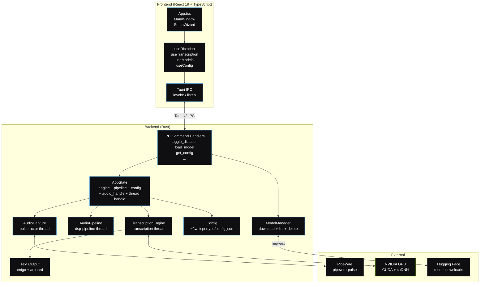
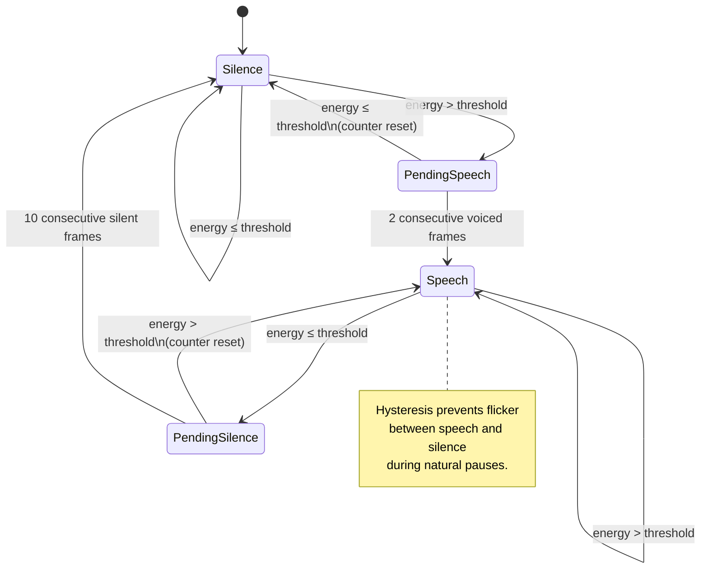
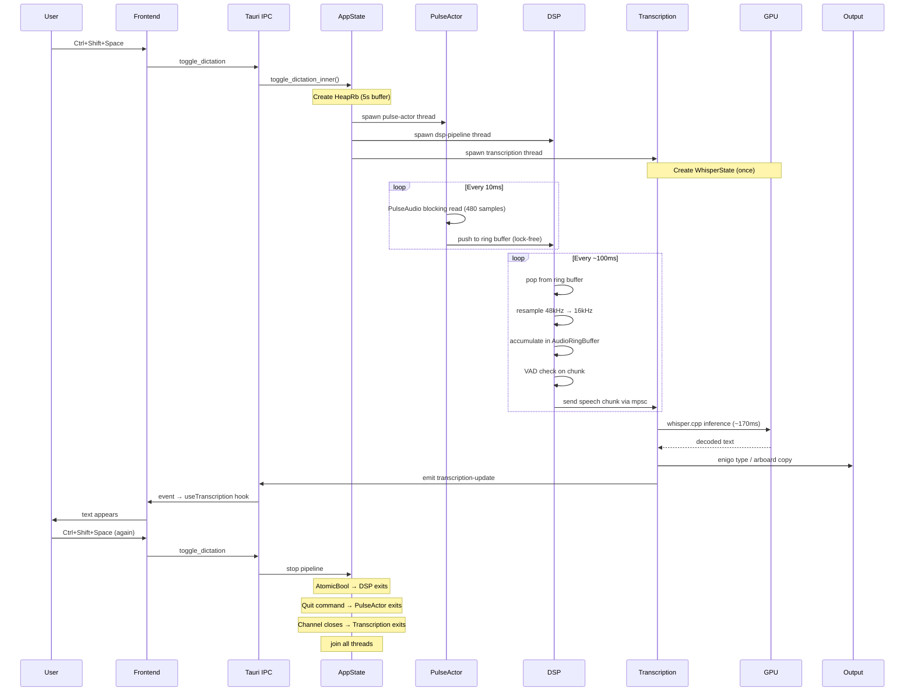

# Architecture

WhisperType is a Tauri v2 desktop application with a Rust backend and React frontend. The backend handles audio capture, signal processing, voice activity detection, and Whisper inference. The frontend is a thin UI layer that sends IPC commands and renders status updates.

---

## System Overview



---

## Components

### Audio Capture (`backend/src/audio/capture.rs`)

The `pulse-actor` thread manages microphone input via PulseAudio's Simple API.

- Connects to PipeWire through `pipewire-pulse` compatibility
- Captures 48kHz mono `FLOAT32NE` in 10ms frames (480 samples)
- Pushes raw f32 samples into a `HeapRb<f32>` lock-free ring buffer (5 seconds capacity at 48kHz = 240,000 samples)
- Responds to `AudioCommand` messages: `Start`, `Stop`, `Quit`
- Exits cleanly only on `Quit` command or read error

The actor pattern keeps PulseAudio's blocking reads isolated. The ring buffer decouples capture timing from processing timing --- the producer never blocks on the consumer.

### DSP Pipeline (`backend/src/audio/mod.rs`)

The `dsp-pipeline` thread drains the ring buffer and prepares audio for Whisper.

1. **Read**: Pops up to 4800 samples (100ms at 48kHz) per iteration from the ring buffer consumer
2. **Mono conversion**: Averages interleaved channels (currently 1 channel from PulseAudio, but handles stereo)
3. **Resample**: Linear interpolation from 48kHz to 16kHz (Whisper's expected rate)
4. **Buffer**: Writes resampled samples into an `AudioRingBuffer` --- a fixed-size circular buffer that extracts 2-second chunks with 500ms overlap
5. **VAD**: Energy-based voice activity detection on each chunk. RMS threshold of 0.012 with hysteresis (2 frames onset, 10 frames offset)
6. **Grace period**: After speech ends, one trailing silent chunk is forwarded to prevent word cutoff
7. **Dispatch**: Speech chunks sent to the transcription thread via `mpsc::channel`

The thread exits when its `AtomicBool` flag is set to `false` by `AudioPipeline::stop()`.

### Voice Activity Detection (`backend/src/audio/vad.rs`)

The VAD operates on 30ms frames (480 samples at 16kHz) within each chunk.



### Transcription Engine (`backend/src/transcription/engine.rs`)

Wraps whisper-rs (which wraps whisper.cpp) and manages GPU lifecycle.

- **WhisperContext**: Created once when a model is loaded. Holds the model weights in VRAM (~3094 MB for large-v3).
- **WhisperState**: Created once per dictation session. Holds CUDA KV caches (~343 MB). Reused across all chunks.
- **Inference parameters**: Greedy decoding, single segment, no timestamps, blank suppression, non-speech token suppression.
- Flash attention enabled by default. Falls back to standard attention if the GPU doesn't support it.

### Audio Ring Buffer (`backend/src/audio/buffer.rs`)

A purpose-built circular buffer for accumulating 16kHz mono audio.

- Configurable chunk size (default: 32,000 samples = 2 seconds at 16kHz)
- Configurable overlap (default: 8,000 samples = 500ms)
- Extraction triggers when `chunk_size - overlap_size` new samples have been written
- The overlap ensures context continuity across chunk boundaries

### Text Output (`backend/src/output/`)

Two output backends, selected by config:

| Mode | Implementation | Notes |
|------|---------------|-------|
| `type_into_field` | `enigo` 0.6 | Keyboard simulation via `x11rb` (X11) or Wayland protocols |
| `clipboard` | `arboard` 3 | System clipboard via X11 selections or Wayland data offers |
| `both` | Both in sequence | Type first, then copy to clipboard |

### Configuration (`backend/src/config/settings.rs`)

JSON config at `~/.whispertype/config.json`. Loaded at startup, persisted on change via Tauri IPC.

### Frontend (`frontend/src/`)

React 19 + TypeScript + Tailwind CSS. Communicates exclusively through Tauri IPC.

| Component | Role |
|-----------|------|
| `App.tsx` | Root. Routes between SetupWizard and MainWindow based on `first_run_complete` |
| `MainWindow` | Primary view. Model selector, transcript display, status indicator, settings overlay |
| `SetupWizard` | First-run flow: GPU check, model selection, model download |
| `SettingsPanel` | Config editor: output mode, language, VAD threshold, hotkey |
| `useDictation` | Hook: listens to `dictation-status` events |
| `useTranscription` | Hook: listens to `transcription-update` events, accumulates transcript |
| `useModels` | Hook: list/download/delete/load models via IPC |
| `useConfig` | Hook: get/update config via IPC |

---

## Data Flow



---

## Concurrency Model

WhisperType uses three `std::thread` instances during active dictation, plus the Tauri main thread.

| Thread | Name | Lifetime | Sync Primitive | Exit Signal |
|--------|------|----------|----------------|-------------|
| **Main** | Tauri event loop | App lifetime | --- | App close |
| **pulse-actor** | `pulse-actor` | Dictation session | `mpsc::Sender<AudioCommand>` | `AudioCommand::Quit` |
| **dsp-pipeline** | `dsp-pipeline` | Dictation session | `Arc<AtomicBool>` | `is_running = false` |
| **transcription** | (unnamed) | Dictation session | `mpsc::Receiver<Vec<f32>>` | Channel close (sender dropped) |

### Shared State

```
AppState (managed by Tauri)
├── engine: Arc<TranscriptionEngine>
│   ├── ctx: Mutex<Option<WhisperContext>>      ← model weights
│   └── active_model: Mutex<Option<String>>
├── pipeline: AudioPipeline
│   ├── is_running: Arc<AtomicBool>             ← DSP thread flag
│   ├── thread_handle: Mutex<Option<JoinHandle>>
│   └── consumer: Mutex<Option<HeapCons<f32>>>  ← returned on stop
├── config: Mutex<Config>
├── transcription_thread: Mutex<Option<JoinHandle<()>>>
├── audio_handle: Mutex<Option<AudioHandle>>
│   └── cmd_tx: Sender<AudioCommand>            ← pulse-actor control
└── last_shortcut: Mutex<Option<Instant>>       ← hotkey debounce
```

### Shutdown Sequence

1. `AudioPipeline::stop()` sets `is_running` to `false` --- DSP thread exits its loop, returns the ring buffer consumer
2. `AudioCommand::Stop` sent to pulse-actor --- actor stops pushing samples
3. `join_transcription_thread()` joins the transcription thread (blocks until it exits)
4. `AudioCommand::Quit` sent to pulse-actor --- actor exits its outer loop
5. Audio handle dropped

The transcription thread exits naturally when the DSP thread's `mpsc::Sender` is dropped (DSP thread exited), closing the channel.

### Hotkey Debounce

The global shortcut handler on the Tauri main thread uses a `Mutex<Option<Instant>>` with a 300ms cooldown. Linux key repeat can fire `Pressed` events every ~30ms during a single keypress. The timestamp debounce ensures only one toggle per physical press.

---

## Key Design Decisions

### ADR-1: libpulse Simple API over cpal

**Context.** The initial implementation used cpal for audio capture. On systems running PipeWire (the default on modern Arch, Fedora, Ubuntu), cpal's ALSA backend exhibited a deadlock-prone interaction where `POLLIN` poll readiness conflicted with PipeWire's graph processing cycle ([cpal#554](https://github.com/RustAudio/cpal/issues/554)).

**Options considered.**
1. cpal with ALSA backend (broken on PipeWire)
2. cpal with PipeWire backend (not yet stable in cpal)
3. PulseAudio Simple API via `libpulse-simple-binding`

**Decision.** Use PulseAudio's Simple API. PipeWire ships `pipewire-pulse` as a drop-in compatibility layer, so `pa_simple_read()` works correctly on every PipeWire system.

**Consequences.** Blocking reads require a dedicated thread. This is fine --- the pulse-actor pattern isolates the blocking call. The tradeoff is a hard dependency on `libpulse` at link time.

### ADR-2: Synchronous threads over async runtime

**Context.** Both whisper-rs (`whisper_full()`) and PulseAudio Simple (`pa_simple_read()`) are blocking C calls. Wrapping them in `tokio::spawn_blocking()` adds runtime complexity without benefit.

**Options considered.**
1. Full async with tokio (spawn_blocking for C calls)
2. Sync `std::thread` per pipeline stage

**Decision.** Three `std::thread` instances with explicit ownership. The DSP thread owns its `AtomicBool`, the pulse-actor owns its command channel, and the transcription thread owns its `mpsc::Receiver`.

**Consequences.** No tokio dependency for the audio pipeline (tokio is still used for HTTP model downloads). Thread lifecycle is explicit and testable. The `join()` calls in shutdown are deterministic.

### ADR-3: WhisperState reuse across chunks

**Context.** `WhisperContext::create_state()` allocates CUDA KV caches (~83 MB self + ~251 MB cross + ~7 MB pad = ~343 MB for large-v3). In early versions, a new state was created per chunk, adding 300-400ms of CUDA allocation overhead.

**Options considered.**
1. Create state per chunk (simple, expensive)
2. Create state once per session, reuse for all chunks

**Decision.** Create `WhisperState` once when dictation starts, pass it to every `transcribe()` call.

**Consequences.** CUDA state init cost is amortized to zero for all chunks after the first. The state holds a C-level pointer into the `WhisperContext` model weights, creating a safety invariant: the state must be dropped before the context is freed. The architecture enforces this by joining the transcription thread (which drops the state) before any model unload operation.

### ADR-4: VAD grace period for trailing speech

**Context.** Energy-based VAD correctly detects silence, but the boundary between speech and silence is fuzzy. The last word of a sentence often has lower energy than the preceding words, causing it to be classified as silence and dropped.

**Options considered.**
1. Lower the VAD threshold globally (increases false positives during actual silence)
2. Send one trailing silent chunk after speech ends

**Decision.** After a sequence of 2+ speech chunks, forward the first silent chunk as a "grace period". Subsequent silent chunks are discarded normally.

**Consequences.** The final word of utterances is preserved. Whisper receives ~500ms of trailing silence which it handles gracefully (suppressed by `set_suppress_blank`). The cost is one extra inference call per speech segment.

---

## Performance Characteristics

Measured on NVIDIA GeForce RTX 5060 Ti (Blackwell, compute capability 12.0, `sm_120`) with `ggml-large-v3.bin`.

| Metric | Value |
|--------|-------|
| Model VRAM usage | 3094 MB |
| CUDA KV cache (state) | ~343 MB |
| Inference per 3s chunk | ~170ms |
| End-to-end latency | ~1.7s (chunk accumulation + inference + output) |
| Audio capture rate | 48kHz mono float32 |
| Whisper input rate | 16kHz mono float32 |
| Ring buffer capacity | 5 seconds (240,000 f32 samples) |
| Chunk duration | 2 seconds (configurable) |
| Chunk overlap | 500ms (configurable) |
| Flash attention | Enabled (fallback to standard if unsupported) |
| GPU idle during silence | Yes (VAD gates inference) |

---

## Known Limitations

- **NVIDIA-only.** whisper.cpp's CUDA backend requires an NVIDIA GPU. AMD ROCm and Intel oneAPI are not supported by this build.
- **No streaming output.** Text appears after each full chunk is transcribed, not word-by-word. The 2-second chunk duration creates a natural cadence but prevents true real-time streaming.
- **Linear resampling.** The 48kHz to 16kHz resampler uses linear interpolation, not a polyphase filter. This is adequate for speech but introduces minor aliasing artifacts above 7kHz. Irrelevant for Whisper's mel spectrogram, but technically imprecise.
- **Single GPU.** Only uses CUDA device 0. Multi-GPU setups are not supported.
- **enigo on Wayland.** Keyboard simulation via enigo works on Wayland through `wl_keyboard` but some compositors restrict input simulation for security. If typing doesn't work, use `clipboard` output mode.
- **No punctuation post-processing.** Whisper's native punctuation is used as-is. There is no sentence boundary detection or capitalization correction beyond what the model produces.
