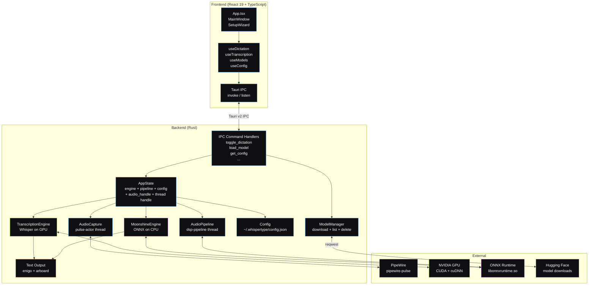
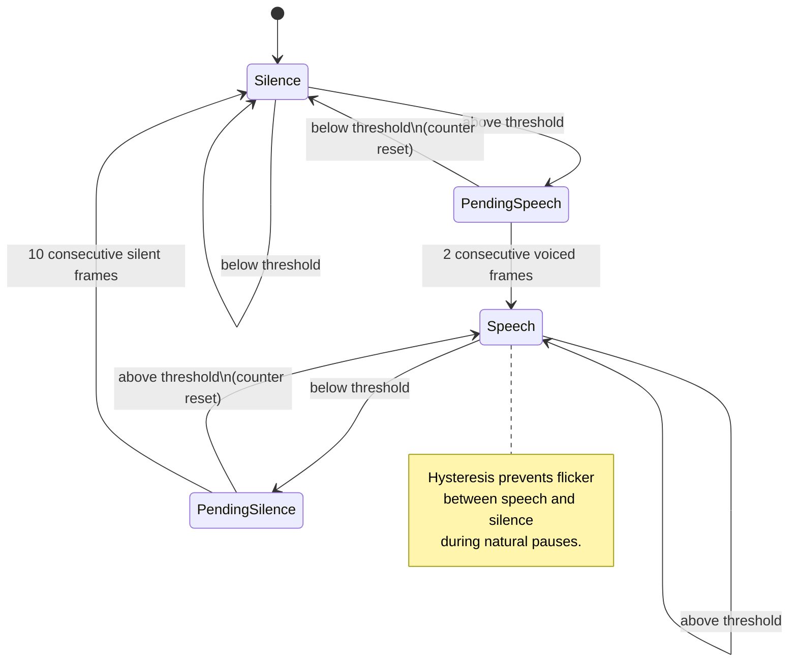
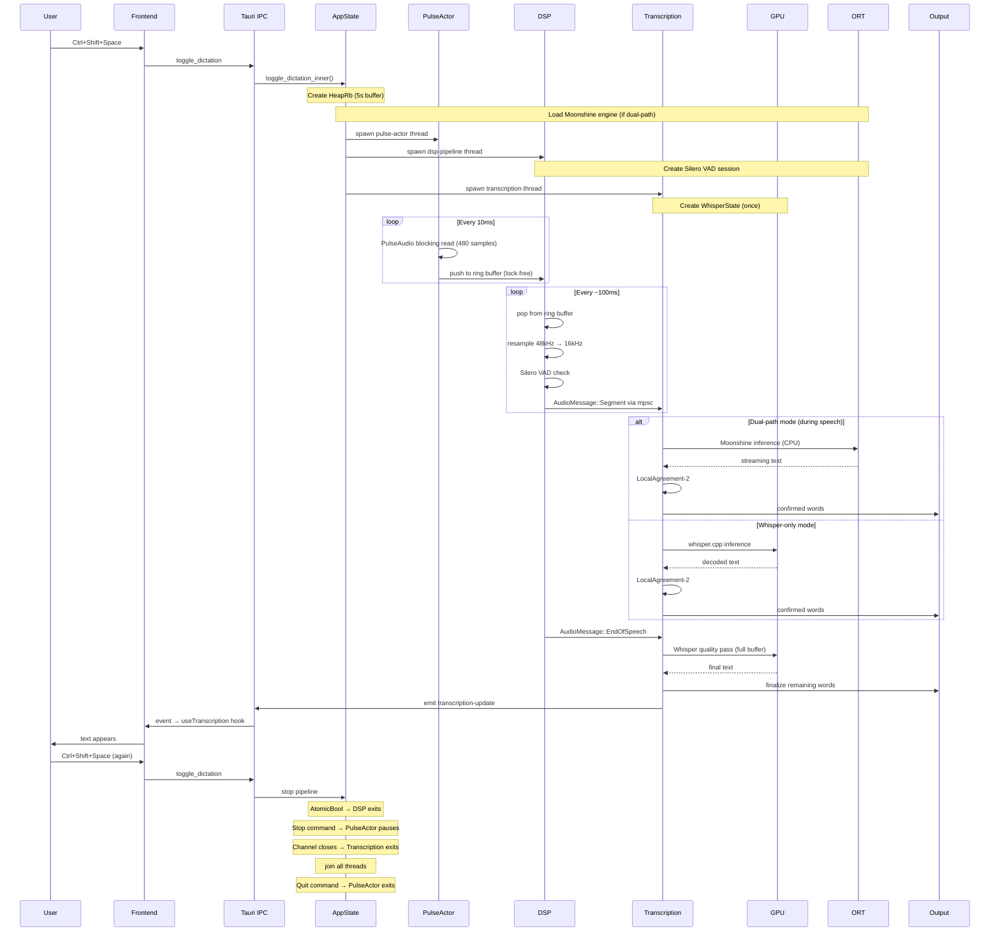

# Architecture

WhisperType is a Tauri v2 desktop application with a Rust backend and React frontend. The backend handles audio capture, signal processing, voice activity detection, and dual-path transcription (Moonshine on CPU for streaming, Whisper on GPU for accuracy). The frontend is a thin UI layer that sends IPC commands and renders status updates.

---

## System Overview


```mermaid
graph TD
    subgraph Frontend["Frontend (React 19 + TypeScript)"]
        UI[App.tsx\nMainWindow\nSetupWizard]
        HOOKS[useDictation\nuseTranscription\nuseModels\nuseConfig]
        IPC_FE[Tauri IPC\ninvoke / listen]
    end

    subgraph Backend["Backend (Rust)"]
        IPC_BE[IPC Command Handlers\ntoggle_dictation\nload_model\nget_config\n...]
        STATE[AppState\nengine + pipeline + config\n+ audio_handle + thread handle]
        CAPTURE[AudioCapture\npulse-actor thread]
        PIPELINE[AudioPipeline\ndsp-pipeline thread]
        ENGINE[TranscriptionEngine\nWhisper on GPU]
        MOONSHINE[MoonshineEngine\nONNX on CPU]
        OUTPUT[Text Output\nenigo + arboard]
        CONFIG[Config\n~/.whispertype/config.json]
        MODELS[ModelManager\ndownload + list + delete]
    end

    subgraph External["External"]
        PULSE[PipeWire\npipewire-pulse]
        GPU[NVIDIA GPU\nCUDA + cuDNN]
        ORT[ONNX Runtime\nlibonnxruntime.so]
        HF[Hugging Face\nmodel downloads]
    end

    UI --> HOOKS
    HOOKS --> IPC_FE
    IPC_FE <-->|Tauri v2 IPC| IPC_BE
    IPC_BE --> STATE
    STATE --> CAPTURE
    STATE --> PIPELINE
    STATE --> ENGINE
    STATE --> MOONSHINE
    ENGINE --> OUTPUT
    MOONSHINE --> OUTPUT
    STATE --> CONFIG
    IPC_BE --> MODELS
    CAPTURE <--> PULSE
    ENGINE <--> GPU
    MOONSHINE <--> ORT
    PIPELINE <--> ORT
    MODELS <-->|reqwest| HF

    style UI fill:#0f0f11,stroke:#4CA9EF,color:#fff
    style HOOKS fill:#0f0f11,stroke:#4CA9EF,color:#fff
    style IPC_FE fill:#0f0f11,stroke:#4CA9EF,color:#fff
    style IPC_BE fill:#0f0f11,stroke:#4CA9EF,color:#fff
    style STATE fill:#0f0f11,stroke:#4CA9EF,color:#fff
    style CAPTURE fill:#0f0f11,stroke:#4CA9EF,color:#fff
    style PIPELINE fill:#0f0f11,stroke:#4CA9EF,color:#fff
    style ENGINE fill:#0f0f11,stroke:#76B900,color:#fff
    style MOONSHINE fill:#0f0f11,stroke:#9B59B6,color:#fff
    style OUTPUT fill:#0f0f11,stroke:#E87722,color:#fff
    style CONFIG fill:#0f0f11,stroke:#4CA9EF,color:#fff
    style MODELS fill:#0f0f11,stroke:#4CA9EF,color:#fff
    style PULSE fill:#0f0f11,stroke:#666,color:#fff
    style GPU fill:#0f0f11,stroke:#76B900,color:#fff
    style ORT fill:#0f0f11,stroke:#9B59B6,color:#fff
    style HF fill:#0f0f11,stroke:#666,color:#fff
```

---

## Components

### Audio Capture (`backend/src/audio/capture.rs`)

The `pulse-actor` thread manages microphone input via PulseAudio's Simple API.

- Connects to PipeWire through `pipewire-pulse` compatibility
- Captures 48kHz mono `FLOAT32NE` in 10ms frames (480 samples)
- Pushes raw f32 samples into a `HeapRb<f32>` lock-free ring buffer (5 seconds capacity at 48kHz = 240,000 samples)
- Responds to `AudioCommand` messages: `Start`, `Stop`, `Quit`
- Exits cleanly only on `Quit` command or read error

The actor pattern keeps PulseAudio's blocking reads isolated. The ring buffer decouples capture timing from processing timing --- the producer never blocks on the consumer.

### DSP Pipeline (`backend/src/audio/mod.rs`)

The `dsp-pipeline` thread drains the ring buffer and prepares audio for inference.

1. **Read**: Pops up to 4800 samples (100ms at 48kHz) per iteration from the ring buffer consumer
2. **Mono conversion**: Averages interleaved channels (currently 1 channel from PulseAudio, but handles stereo)
3. **Resample**: Linear interpolation from 48kHz to 16kHz (Whisper's expected rate)
4. **Silero VAD**: Neural network voice activity detection on 30ms frames (480 samples at 16kHz). 0.97 ROC-AUC across 6000+ languages at <1ms per frame on CPU.
5. **Dispatch**: Audio segments sent to the transcription thread via `mpsc::channel` as `AudioMessage::Segment` or `AudioMessage::EndOfSpeech`

The thread exits when its `AtomicBool` flag is set to `false` by `AudioPipeline::stop()`.

### Voice Activity Detection (`backend/src/audio/vad.rs`)

Two VAD backends are available, selectable via config:

| Backend | Implementation | Latency | Accuracy |
|---------|---------------|---------|----------|
| **Silero** | Neural network (ONNX Runtime) | <1ms per 30ms frame | 0.97 ROC-AUC |
| **Energy** | RMS threshold with hysteresis | ~0ms | Adequate for clean environments |


```mermaid
stateDiagram-v2
    [*] --> Silence
    Silence --> Silence : below threshold
    Silence --> PendingSpeech : above threshold
    PendingSpeech --> Speech : 2 consecutive voiced frames
    PendingSpeech --> Silence : below threshold\n(counter reset)
    Speech --> Speech : above threshold
    Speech --> PendingSilence : below threshold
    PendingSilence --> Speech : above threshold\n(counter reset)
    PendingSilence --> Silence : 10 consecutive silent frames

    note right of Speech
        Hysteresis prevents flicker
        between speech and silence
        during natural pauses.
    end note
```

### Transcription Engine (`backend/src/transcription/engine.rs`)

Wraps whisper-rs (which wraps whisper.cpp) and manages GPU lifecycle.

- **WhisperContext**: Created once when a model is loaded. Holds the model weights in VRAM (~3094 MB for large-v3, ~2000 MB for distil-large-v3).
- **WhisperState**: Created once per dictation session. Holds CUDA KV caches (~343 MB). Reused across all inference passes.
- **Inference parameters**: Greedy decoding, single segment, no timestamps, blank suppression, non-speech token suppression.
- Flash attention enabled by default. Falls back to standard attention if the GPU doesn't support it.

### Moonshine Engine (`backend/src/transcription/moonshine.rs`)

Wraps transcribe-rs for CPU-only ONNX inference with the Moonshine model family.

- **Model variants**: Tiny (~28 MB quantized) and Base (~63 MB quantized)
- **Session files**: `encoder_model.onnx`, `decoder_model_merged.onnx`, `tokenizer.json`
- **Runtime**: ONNX Runtime via `ort` 2.0.0-rc.10 with `load-dynamic` (shared with Silero VAD)
- **Initialization**: Must be loaded before `pipeline.start()` to prevent ORT session race conditions (see ADR-5)

### Dual-Path Inference (`backend/src/commands/dictation.rs`)

The transcription thread implements two inference paths depending on the `stream_engine` config:

**Whisper-only mode** (default): Each audio segment triggers a Whisper inference pass on the GPU. Words are confirmed through LocalAgreement-2 and output incrementally. On EndOfSpeech, remaining tentative words are finalized.

**Moonshine + Whisper mode**: During speech, Moonshine runs on the CPU for instant streaming previews. Words pass through LocalAgreement-2 for confirmation. On EndOfSpeech, Whisper runs the full accumulated audio buffer on the GPU for a final accuracy pass, then all remaining tentative words are finalized and output.

### LocalAgreement-2 (`backend/src/transcription/agreement.rs`)

Word-level deduplication across consecutive inference passes. When the same word appears at the same position in two consecutive passes, it is "confirmed" and immediately output to the user. Unconfirmed words are displayed as tentative (gray italic in the UI).

### Model Registry (`backend/src/transcription/models.rs`)

Static registry of 9 available models:

| Model | Type | Size | Runtime |
|-------|------|------|---------|
| tiny, base, small, medium | Whisper GGML | 75 MB -- 1.5 GB | GPU (CUDA) |
| large-v3 | Whisper GGML | 3.1 GB | GPU (CUDA) |
| distil-large-v3 | Whisper GGML | 1.5 GB | GPU (CUDA) |
| large-v3-turbo | Whisper GGML | 1.6 GB | GPU (CUDA) |
| moonshine-tiny | ONNX | 28 MB | CPU (ORT) |
| moonshine-base | ONNX | 63 MB | CPU (ORT) |

Whisper models are single `.bin` files. Moonshine models are directories containing 3 ONNX/tokenizer files downloaded individually.

### Text Output (`backend/src/output/`)

Two output backends, selected by config:

| Mode | Implementation | Notes |
|------|---------------|-------|
| `type_into_field` | `enigo` 0.6 | Keyboard simulation via `x11rb` (X11) or Wayland protocols |
| `clipboard` | `arboard` 3 | System clipboard via X11 selections or Wayland data offers |
| `both` | Both in sequence | Type first, then copy to clipboard |

### Configuration (`backend/src/config/settings.rs`)

JSON config at `~/.whispertype/config.json`. Loaded at startup, persisted on change via Tauri IPC. New fields use `#[serde(default)]` for backward compatibility with older config files.

### Frontend (`frontend/src/`)

React 19 + TypeScript + Tailwind CSS. Communicates exclusively through Tauri IPC.

| Component | Role |
|-----------|------|
| `App.tsx` | Root. Routes between SetupWizard and MainWindow based on `first_run_complete` |
| `MainWindow` | Primary view. Model selector, transcript display, status indicator, settings overlay |
| `SetupWizard` | First-run flow: GPU check, model selection, model download |
| `SettingsPanel` | Config editor: output mode, stream engine, language, VAD backend, hotkey |
| `useDictation` | Hook: listens to `dictation-status` events |
| `useTranscription` | Hook: listens to `transcription-update` events, accumulates transcript |
| `useModels` | Hook: list/download/delete/load models via IPC |
| `useConfig` | Hook: get/update config via IPC |

---

## Data Flow


```mermaid
sequenceDiagram
    participant User
    participant Frontend
    participant Tauri IPC
    participant AppState
    participant PulseActor
    participant DSP
    participant Transcription
    participant GPU
    participant ORT
    participant Output

    User->>Frontend: Ctrl+Shift+Space
    Frontend->>Tauri IPC: toggle_dictation
    Tauri IPC->>AppState: toggle_dictation_inner()

    Note over AppState: Create HeapRb (5s buffer)
    Note over AppState,ORT: Load Moonshine engine (if dual-path)
    AppState->>PulseActor: spawn pulse-actor thread
    AppState->>DSP: spawn dsp-pipeline thread
    Note over DSP,ORT: Create Silero VAD session
    AppState->>Transcription: spawn transcription thread

    Note over Transcription,GPU: Create WhisperState (once)

    loop Every 10ms
        PulseActor->>PulseActor: PulseAudio blocking read (480 samples)
        PulseActor->>DSP: push to ring buffer (lock-free)
    end

    loop Every ~100ms
        DSP->>DSP: pop from ring buffer
        DSP->>DSP: resample 48kHz → 16kHz
        DSP->>DSP: Silero VAD check
        DSP->>Transcription: AudioMessage::Segment via mpsc
    end

    alt Dual-path mode (during speech)
        Transcription->>ORT: Moonshine inference (CPU)
        ORT-->>Transcription: streaming text
        Transcription->>Transcription: LocalAgreement-2
        Transcription->>Output: confirmed words
    else Whisper-only mode
        Transcription->>GPU: whisper.cpp inference
        GPU-->>Transcription: decoded text
        Transcription->>Transcription: LocalAgreement-2
        Transcription->>Output: confirmed words
    end

    DSP->>Transcription: AudioMessage::EndOfSpeech
    Transcription->>GPU: Whisper quality pass (full buffer)
    GPU-->>Transcription: final text
    Transcription->>Output: finalize remaining words
    Transcription->>Tauri IPC: emit transcription-update
    Tauri IPC->>Frontend: event → useTranscription hook
    Frontend->>User: text appears

    User->>Frontend: Ctrl+Shift+Space (again)
    Frontend->>Tauri IPC: toggle_dictation
    Tauri IPC->>AppState: stop pipeline

    Note over AppState: AtomicBool → DSP exits
    Note over AppState: Stop command → PulseActor pauses
    Note over AppState: Channel closes → Transcription exits
    Note over AppState: join all threads
    Note over AppState: Quit command → PulseActor exits
```

---

## Concurrency Model

WhisperType uses three `std::thread` instances during active dictation, plus the Tauri main thread.

| Thread | Name | Lifetime | Sync Primitive | Exit Signal |
|--------|------|----------|----------------|-------------|
| **Main** | Tauri event loop | App lifetime | --- | App close |
| **pulse-actor** | `pulse-actor` | Dictation session | `mpsc::Sender<AudioCommand>` | `AudioCommand::Quit` |
| **dsp-pipeline** | `dsp-pipeline` | Dictation session | `Arc<AtomicBool>` | `is_running = false` |
| **transcription** | (unnamed) | Dictation session | `mpsc::Receiver<AudioMessage>` | Channel close (sender dropped) |

### Shared State

```
AppState (managed by Tauri)
├── engine: Arc<TranscriptionEngine>
│   ├── ctx: Mutex<Option<WhisperContext>>      ← model weights
│   └── active_model: Mutex<Option<String>>
├── pipeline: AudioPipeline
│   ├── is_running: Arc<AtomicBool>             ← DSP thread flag
│   ├── thread_handle: Mutex<Option<JoinHandle>>
│   └── consumer: Mutex<Option<HeapCons<f32>>>  ← returned on stop
├── config: Mutex<Config>
├── transcription_thread: Mutex<Option<JoinHandle<()>>>
├── audio_handle: Mutex<Option<AudioHandle>>
│   └── cmd_tx: Sender<AudioCommand>            ← pulse-actor control
└── last_shortcut: Mutex<Option<Instant>>       ← hotkey debounce
```

### ONNX Runtime Session Ordering

ONNX Runtime (`ort` 2.0.0-rc.10) is loaded dynamically at runtime via `load-dynamic`. A single `OnceLock<Environment>` holds the global ORT environment, shared by both Silero VAD (created in the DSP thread) and Moonshine (passed into the transcription thread).

**Critical constraint**: ORT sessions must not be created concurrently from different threads against the same dynamically-loaded library. Concurrent creation causes `GetElementType is not implemented` errors in session inference.

**Solution**: `toggle_dictation_inner()` loads Moonshine *before* calling `pipeline.start()`, which creates the Silero VAD session inside the DSP thread. This ensures all ORT sessions are created sequentially. Additionally, `ort::init().commit()` is called eagerly at app startup in `lib.rs::run()` to initialize the ORT environment before any sessions are created.

### Shutdown Sequence

1. `AudioPipeline::stop()` sets `is_running` to `false` --- DSP thread exits its loop, returns the ring buffer consumer
2. `AudioCommand::Stop` sent to pulse-actor --- actor stops pushing samples
3. `join_transcription_thread()` joins the transcription thread (blocks until it exits)
4. `AudioCommand::Quit` sent to pulse-actor --- actor exits its outer loop
5. Audio handle dropped

The transcription thread exits naturally when the DSP thread's `mpsc::Sender` is dropped (DSP thread exited), closing the channel.

### Hotkey Debounce

The global shortcut handler on the Tauri main thread uses a `Mutex<Option<Instant>>` with a 300ms cooldown. Linux key repeat can fire `Pressed` events every ~30ms during a single keypress. The timestamp debounce ensures only one toggle per physical press.

---

## Key Design Decisions

### ADR-1: libpulse Simple API over cpal

**Context.** The initial implementation used cpal for audio capture. On systems running PipeWire (the default on modern Arch, Fedora, Ubuntu), cpal's ALSA backend exhibited a deadlock-prone interaction where `POLLIN` poll readiness conflicted with PipeWire's graph processing cycle ([cpal#554](https://github.com/RustAudio/cpal/issues/554)).

**Options considered.**
1. cpal with ALSA backend (broken on PipeWire)
2. cpal with PipeWire backend (not yet stable in cpal)
3. PulseAudio Simple API via `libpulse-simple-binding`

**Decision.** Use PulseAudio's Simple API. PipeWire ships `pipewire-pulse` as a drop-in compatibility layer, so `pa_simple_read()` works correctly on every PipeWire system.

**Consequences.** Blocking reads require a dedicated thread. This is fine --- the pulse-actor pattern isolates the blocking call. The tradeoff is a hard dependency on `libpulse` at link time.

### ADR-2: Synchronous threads over async runtime

**Context.** Both whisper-rs (`whisper_full()`) and PulseAudio Simple (`pa_simple_read()`) are blocking C calls. Wrapping them in `tokio::spawn_blocking()` adds runtime complexity without benefit.

**Options considered.**
1. Full async with tokio (spawn_blocking for C calls)
2. Sync `std::thread` per pipeline stage

**Decision.** Three `std::thread` instances with explicit ownership. The DSP thread owns its `AtomicBool`, the pulse-actor owns its command channel, and the transcription thread owns its `mpsc::Receiver`.

**Consequences.** No tokio dependency for the audio pipeline (tokio is still used for HTTP model downloads). Thread lifecycle is explicit and testable. The `join()` calls in shutdown are deterministic.

### ADR-3: WhisperState reuse across chunks

**Context.** `WhisperContext::create_state()` allocates CUDA KV caches (~83 MB self + ~251 MB cross + ~7 MB pad = ~343 MB for large-v3). In early versions, a new state was created per chunk, adding 300-400ms of CUDA allocation overhead.

**Options considered.**
1. Create state per chunk (simple, expensive)
2. Create state once per session, reuse for all chunks

**Decision.** Create `WhisperState` once when dictation starts, pass it to every `transcribe()` call.

**Consequences.** CUDA state init cost is amortized to zero for all chunks after the first. The state holds a C-level pointer into the `WhisperContext` model weights, creating a safety invariant: the state must be dropped before the context is freed. The architecture enforces this by joining the transcription thread (which drops the state) before any model unload operation.

### ADR-4: VAD grace period for trailing speech

**Context.** Energy-based VAD correctly detects silence, but the boundary between speech and silence is fuzzy. The last word of a sentence often has lower energy than the preceding words, causing it to be classified as silence and dropped.

**Options considered.**
1. Lower the VAD threshold globally (increases false positives during actual silence)
2. Send one trailing silent chunk after speech ends

**Decision.** After a sequence of 2+ speech chunks, forward the first silent chunk as a "grace period". Subsequent silent chunks are discarded normally.

**Consequences.** The final word of utterances is preserved. Whisper receives ~500ms of trailing silence which it handles gracefully (suppressed by `set_suppress_blank`). The cost is one extra inference call per speech segment.

### ADR-5: Sequential ORT session initialization

**Context.** v0.3.0 introduced two independent ONNX Runtime consumers: Silero VAD (in the DSP thread) and Moonshine (in the transcription thread). Both use `ort` 2.0.0-rc.10 with `load-dynamic`, sharing a single `libonnxruntime.so`. When Moonshine was loaded inside the transcription thread concurrently with Silero VAD session creation in the DSP thread, `GetElementType is not implemented` errors occurred during Silero inference.

**Options considered.**
1. Load Moonshine inside the transcription thread (concurrent with DSP thread --- broken)
2. Load Moonshine before `pipeline.start()` in the main thread (sequential)
3. Add a mutex around all ORT session creation (complex, error-prone)
4. Fork silero-vad-rust to control initialization (high maintenance burden)

**Decision.** Load Moonshine before calling `pipeline.start()` in `toggle_dictation_inner()`. This ensures Moonshine's ORT sessions (encoder + decoder) are fully created before the DSP thread starts and creates the Silero VAD session. Additionally, call `ort::init().commit()` eagerly at app startup.

**Consequences.** All ORT sessions are created sequentially on known threads. The Moonshine engine is passed into the transcription thread as a pre-loaded value (`let mut moonshine = moonshine;`). Dictation start is ~200ms slower due to Moonshine loading, but this is invisible to the user since it happens before "listening" status is emitted.

### ADR-6: Dual-path inference over single-engine streaming

**Context.** Whisper on GPU produces excellent transcriptions but adds latency during continuous speech (each pass takes ~70ms for distil-large-v3). Moonshine on CPU runs in ~15ms but has lower accuracy. Users want both fast feedback and accurate final text.

**Options considered.**
1. Whisper-only with LocalAgreement-2 (v0.2.0 behavior --- good accuracy, moderate latency)
2. Moonshine-only (fast but lower accuracy, English-only)
3. Dual-path: Moonshine for streaming, Whisper for EndOfSpeech quality pass

**Decision.** Dual-path inference, configurable via `stream_engine` setting. Moonshine handles streaming previews during speech. When Silero VAD fires EndOfSpeech, Whisper runs the full accumulated audio buffer for a final accuracy pass.

**Consequences.** Sub-200ms perceived word appearance during speech. Whisper-grade accuracy on the final transcript. CPU and GPU are utilized in parallel (Moonshine on CPU during speech, Whisper on GPU at end of speech). The tradeoff is ~28 MB additional memory for the Moonshine model and slightly more complex inference logic.

---

## Performance Characteristics

Measured on NVIDIA GeForce RTX 5060 Ti (Blackwell, compute capability 12.0, `sm_120`).

| Metric | Whisper-only (distil-large-v3) | Dual-path (Moonshine + distil-large-v3) |
|--------|-------------------------------|----------------------------------------|
| Model VRAM usage | ~2000 MB | ~2000 MB (Moonshine uses CPU RAM) |
| Moonshine model size | N/A | ~28 MB (CPU) |
| Streaming inference latency | ~70ms (GPU) | ~15ms (CPU, Moonshine) |
| Quality pass latency | ~70ms per pass | ~70ms (one pass at EndOfSpeech) |
| Perceived word appearance | ~200ms | <200ms |
| Audio capture rate | 48kHz mono float32 | 48kHz mono float32 |
| Whisper input rate | 16kHz mono float32 | 16kHz mono float32 |
| Ring buffer capacity | 5 seconds (240,000 f32 samples) | 5 seconds (240,000 f32 samples) |
| Flash attention | Enabled | Enabled |
| GPU idle during silence | Yes (VAD gates inference) | Yes (VAD gates inference) |

---

## Known Limitations

- **NVIDIA-only for Whisper.** whisper.cpp's CUDA backend requires an NVIDIA GPU. AMD ROCm and Intel oneAPI are not supported by this build. Moonshine runs on CPU and works without a GPU.
- **Moonshine is English-only.** The Moonshine model family is trained on English speech. For multilingual use, stick with Whisper-only mode.
- **Linear resampling.** The 48kHz to 16kHz resampler uses linear interpolation, not a polyphase filter. This is adequate for speech but introduces minor aliasing artifacts above 7kHz. Irrelevant for Whisper's mel spectrogram, but technically imprecise.
- **Single GPU.** Only uses CUDA device 0. Multi-GPU setups are not supported.
- **enigo on Wayland.** Keyboard simulation via enigo works on Wayland through `wl_keyboard` but some compositors restrict input simulation for security. If typing doesn't work, use `clipboard` output mode.
- **No punctuation post-processing.** Whisper's native punctuation is used as-is. There is no sentence boundary detection or capitalization correction beyond what the model produces.
- **ORT version sensitivity.** System-installed `libonnxruntime.so` version must be compatible with ort 2.0.0-rc.10 expectations (tested with ORT 1.19.x and 1.24.x). Mismatches may cause session creation failures.
