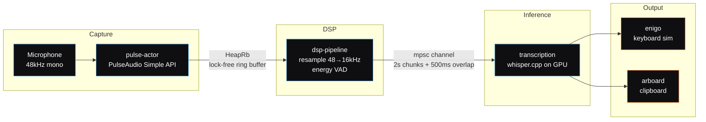
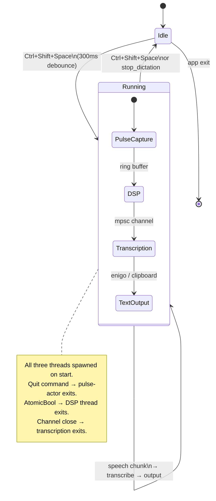

<h1 align="center">WhisperType</h1>

<p align="center">
  <a href="LICENSE"></a>
  <a href="#requirements"></a>
  <a href="#requirements"></a>
  <a href="#requirements"></a>
  <a href="#requirements"></a>
</p>

<p align="center">
  <strong>Local speech-to-text that runs entirely on your GPU. No cloud. No API keys. No telemetry.</strong>
</p>

<p align="center">
  <em>Press Ctrl+Shift+Space. Speak. Text appears at your cursor. Press again to stop.</em>
</p>

---

## Why WhisperType?

Every dictation tool worth using sends your voice to someone else's server. WhisperType doesn't. It runs OpenAI's Whisper large-v3 directly on your NVIDIA GPU via whisper.cpp, transcribing 3 seconds of speech in ~170ms with zero network calls. Your audio never leaves your machine.

The entire pipeline --- capture, DSP, VAD, inference, text output --- runs in three coordinated threads with no async runtime overhead. CUDA state is allocated once per session, not per chunk, eliminating the 300-400ms initialization penalty that naive implementations pay on every utterance.

---

## Features

WhisperType is a single-purpose tool: hear speech, produce text, stay out of the way.

| Feature | Details |
|---------|---------|
| **Local-only** | No cloud, no API keys, no telemetry, no subscriptions |
| **CUDA-accelerated** | whisper.cpp with flash attention on NVIDIA GPUs |
| **All Whisper models** | tiny through large-v3, downloadable from the app UI |
| **Global hotkey** | `Ctrl+Shift+Space` toggles dictation from any application |
| **Output modes** | Type into the focused field, copy to clipboard, or both |
| **PipeWire-native** | Audio capture via `pipewire-pulse` at 48kHz, resampled to 16kHz mono |
| **Voice activity detection** | Energy-based VAD with hysteresis filters silence before it reaches the GPU |
| **Multi-language** | English, Spanish, French, German, Japanese, Chinese, or auto-detect |
| **Session-optimized** | WhisperState created once per session --- 0ms per-chunk CUDA init overhead |

---

## Requirements

| Requirement | Version | Notes |
|-------------|---------|-------|
| **OS** | Linux | PipeWire with `pipewire-pulse`. X11 or Wayland. |
| **GPU** | NVIDIA RTX 20-series+ | Any GPU with CUDA compute capability 7.0+ |
| **CUDA Toolkit** | 12.0+ | With cuDNN |
| **Rust** | 1.77+ | Via [rustup](https://rustup.rs) |
| **Node.js** | 20+ | For the frontend build |
| **CMake** | 3.18+ | Required by whisper.cpp CUDA build |

### System Packages

<details>
<summary><strong>Arch Linux / CachyOS</strong></summary>

```bash
sudo pacman -S webkit2gtk-4.1 libappindicator-gtk3 librsvg patchelf \
  libpulse pkg-config cmake base-devel cuda cudnn
```
</details>

<details>
<summary><strong>Debian / Ubuntu</strong></summary>

```bash
sudo apt install libwebkit2gtk-4.1-dev libappindicator3-dev librsvg2-dev \
  patchelf libpulse-dev pkg-config cmake build-essential
```

CUDA and cuDNN must be installed separately via the [NVIDIA CUDA Toolkit](https://developer.nvidia.com/cuda-downloads).
</details>

---

## Quick Start

```bash
git clone https://github.com/ponderrr/local-stt.git
cd local-stt
npm install
npx tauri dev
```

Four commands. First launch opens a setup wizard that walks you through model download and GPU detection.

---

## Installation

### Development

```bash
npx tauri dev
```

Starts both the Vite frontend dev server and the Rust backend with hot-reload.

### Production Build

```bash
npx tauri build
```

### NVIDIA Blackwell GPUs (RTX 50-series)

Blackwell cards (compute capability 12.0) need the CUDA architecture specified explicitly:

```bash
CMAKE_CUDA_ARCHITECTURES=120 npx tauri build
```

### CPU-Only Build (no CUDA)

```bash
cd backend
cargo build --no-default-features
```

---

## Usage

1. Launch WhisperType
2. Select a model from the dropdown --- `large-v3` recommended for accuracy
3. Download the model if it isn't on disk yet
4. Press **Ctrl+Shift+Space** to start dictation
5. Speak naturally --- text is transcribed in real time
6. Press **Ctrl+Shift+Space** again to stop

Text output follows your configured mode: typed directly into the focused field via keyboard simulation, copied to the system clipboard, or both.

---

## Architecture

WhisperType uses a three-thread pipeline. Each thread has a single responsibility and communicates through lock-free or bounded channels.





**Why libpulse over cpal?** The cpal crate has a known issue ([cpal#554](https://github.com/RustAudio/cpal/issues/554)) where ALSA's `POLLIN` flag conflicts with PipeWire's graph processing model. Blocking reads via PulseAudio's Simple API sidestep this entirely --- PipeWire's `pipewire-pulse` compatibility layer handles the scheduling.

**Thread-per-stage, not async.** Both whisper-rs and PulseAudio's Simple API are blocking. An async runtime would just park a thread anyway. Three `std::thread` instances with explicit ownership is simpler to reason about and has zero runtime overhead.

**WhisperState reuse.** Creating a `WhisperState` allocates CUDA KV caches (~343 MB for large-v3). Doing this per-chunk adds 300-400ms of latency. WhisperType creates the state once when dictation starts and reuses it for every chunk in the session.

**VAD grace period.** The energy-based VAD uses hysteresis (2 frames onset, 10 frames offset) plus a 1-chunk trailing grace period at the pipeline level. This prevents the last word of a sentence from being cut off when the speaker pauses briefly.

See [ARCHITECTURE.md](ARCHITECTURE.md) for the full component breakdown, concurrency model, and design decision records.

---

## Tech Stack

| Layer | Technology |
|-------|-----------|
| Desktop framework | [Tauri v2](https://v2.tauri.app) |
| Backend | Rust (Edition 2021) |
| Frontend | React 19 + TypeScript + Tailwind CSS |
| Transcription | [whisper.cpp](https://github.com/ggerganov/whisper.cpp) via [whisper-rs 0.15](https://github.com/tazz4843/whisper-rs) |
| Audio capture | PulseAudio Simple API (`libpulse-simple`) through PipeWire |
| Text output | [enigo 0.6](https://github.com/enigo-rs/enigo) (X11 `x11rb` / Wayland) + [arboard 3](https://github.com/1Password/arboard) (clipboard) |
| Audio pipeline | Lock-free ring buffer ([ringbuf 0.4](https://crates.io/crates/ringbuf)) + `std::sync::mpsc` |

---

## Configuration

Configuration lives at `~/.whispertype/config.json`. Models are stored in `~/.whispertype/models/`.

| Setting | Default | Description |
|---------|---------|-------------|
| `hotkey` | `Ctrl+Shift+Space` | Global toggle shortcut |
| `output_mode` | `both` | `type_into_field`, `clipboard`, or `both` |
| `audio_device` | `null` | PulseAudio source name (`null` = system default) |
| `language` | `auto` | `en`, `es`, `fr`, `de`, `ja`, `zh`, or `auto` |
| `default_model` | `large-v3` | Model loaded on startup |
| `vad_threshold` | `0.012` | VAD RMS energy threshold --- lower = more sensitive |
| `chunk_duration_ms` | `2000` | Audio chunk length sent to Whisper (ms) |
| `overlap_ms` | `500` | Overlap between consecutive chunks (ms) |

---

## Contributing

Contributions welcome. See [CONTRIBUTING.md](CONTRIBUTING.md) for full details. Questions or ideas? Open a thread in [GitHub Discussions](https://github.com/ponderrr/local-stt/discussions).

```bash
git clone https://github.com/ponderrr/local-stt.git
cd local-stt && npm install
npx tauri dev                              # run in dev mode
cd backend && cargo test                   # 111 tests, all must pass
cd backend && cargo clippy -- -D warnings  # zero warnings
```

---

## License

MIT --- see [LICENSE](LICENSE) for details.

---

<p align="center">
  Built by <a href="https://github.com/ponderrr">Andrew Ponder</a>
</p>
